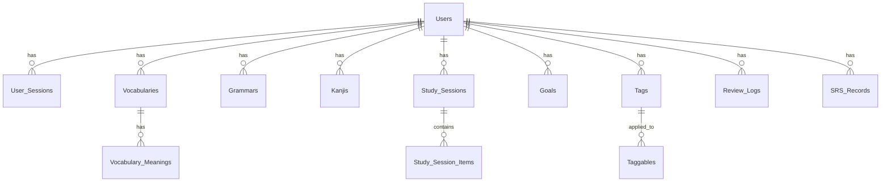

# Database Specification

## Tabel Users
| Column | Type | Constraint |
|---|---|---|
| id | UUID | PK, DEFAULT: gen_random_uuid() |
| name | VARCHAR(100) | NOT NULL |
| email | VARCHAR(225) | UNIQUE, NOT NULL |
| password_hash | TEXT | NOT NULL |
| google_id | TEXT | UNIQUE, NULL |
| avatar_url | TEXT | NULL |
| is_verified | BOOLEAN | DEFAULT: false |
| created_at | TIMESTAMP | NOT NULL |
| updated_at | TIMESTAMP | NOT NULL |
| deleted_at | TIMESTAMP | NULL |

## Tabel User Sessions
| Column | Type | Constraint |
|---|---|---|
| id | UUID | PK, DEFAULT: gen_random_uuid() |
| token_id | UUID | UNIQUE, NOT NULL |
| user_id | UUID | FK (Users.id), NOT NULL |
| refresh_token_hash | TEXT | NOT NULL |
| device_name | VARCHAR(255) | NULL |
| ip_address | VARCHAR(255) | NULL |
| user_agent | TEXT | NULL |
| expires_at | TIMESTAMP | NOT NULL |
| last_used_at | TIMESTAMP | NULL |
| created_at | TIMESTAMP | NOT NULL |
| updated_at | TIMESTAMP | NOT NULL |

## Tabel Vocabularies
| Column | Type | Constraint |
|---|---|---|
| id | UUID | PK, DEFAULT: gen_random_uuid() |
| user_id | UUID | FK (Users.id), NOT NULL |
| word | VARCHAR(255) | NOT NULL |
| reading | TEXT | NULL |
| source | TEXT | NULL |
| note | TEXT | NULL |
| status | VARCHAR(20) | DEFAULT: 'NEW' |
| favourite | BOOLEAN | DEFAULT: false |
| created_at | TIMESTAMP | NOT NULL |
| updated_at | TIMESTAMP | NOT NULL |
| deleted_at | TIMESTAMP | NULL |

## Tabel Vocabulary Meanings
| Column | Type | Constraint |
|---|---|---|
| id | UUID | PK, DEFAULT: gen_random_uuid() |
| vocabulary_id | UUID | FK (Vocabularies.id), NOT NULL |
| meaning | TEXT | NOT NULL |
| order_number | INTEGER | NOT NULL |
| created_at | TIMESTAMP | NOT NULL |
| updated_at | TIMESTAMP | NOT NULL |

## Tabel Grammars
| Column | Type | Constraint |
|---|---|---|
| id | UUID | PK, DEFAULT: gen_random_uuid() |
| user_id | UUID | FK (Users.id), NOT NULL |
| pattern | VARCHAR(255) | NOT NULL |
| meaning | TEXT | NULL |
| example | TEXT | NULL |
| note | TEXT | NULL |
| image_url | TEXT | NULL |
| favourite | BOOLEAN | DEFAULT: false |
| created_at | TIMESTAMP | NOT NULL |
| updated_at | TIMESTAMP | NOT NULL |
| deleted_at | TIMESTAMP | NULL |

## Tabel Kanjis
| Column | Type | Constraint |
|---|---|---|
| id | UUID | PK, DEFAULT: gen_random_uuid() |
| user_id | UUID | FK (Users.id), NOT NULL |
| character | VARCHAR(10) | NOT NULL |
| meaning | TEXT | NULL |
| onyomi | TEXT | NULL |
| kunyomi | TEXT | NULL |
| jlpt_level | VARCHAR(10) | NULL |
| favourite | BOOLEAN | DEFAULT: false |
| created_at | TIMESTAMP | NOT NULL |
| updated_at | TIMESTAMP | NOT NULL |
| deleted_at | TIMESTAMP | NULL |

## Tabel Study Sessions
| Column | Type | Constraint |
|---|---|---|
| id | UUID | PK |
| user_id | UUID | FK (Users.id), NOT NULL, INDEX |
| session_date | DATE | NOT NULL, INDEX |
| notes | TEXT | NULL |
| reflection | TEXT | NULL |
| created_at | TIMESTAMP | NOT NULL |
| updated_at | TIMESTAMP | NOT NULL |
| deleted_at | TIMESTAMP | NULL |

## Tabel Study Session Items
| Column | Type | Constraint |
|---|---|---|
| id | UUID | PK |
| study_session_id | UUID | FK (StudySessions.id), NOT NULL, INDEX |
| item_type | VARCHAR(50) | NOT NULL, INDEX |
| item_id | UUID | NOT NULL, INDEX |
| created_at | TIMESTAMP | NOT NULL |
| updated_at | TIMESTAMP | NOT NULL |
| deleted_at | TIMESTAMP | NULL |

## Tabel Goals
| Column | Type | Constraint |
|---|---|---|
| id | UUID | PK, DEFAULT: gen_random_uuid() |
| user_id | UUID | FK (Users.id), NOT NULL, INDEX |
| title | VARCHAR(255) | NOT NULL |
| description | TEXT | NULL |
| goal_type | VARCHAR(20) | NULL |
| target_level | VARCHAR(10) | NULL |
| target_count | INTEGER | NULL |
| target_date | DATE | NOT NULL |
| status | VARCHAR(20) | DEFAULT: 'IN_PROGRESS' |
| created_at | TIMESTAMP | NOT NULL |
| updated_at | TIMESTAMP | NOT NULL |
| deleted_at | TIMESTAMP | NULL |

## Tabel Tags
| Column | Type | Constraint |
|---|---|---|
| id | UUID | PK, DEFAULT: gen_random_uuid() |
| user_id | UUID | FK (Users.id), NOT NULL, INDEX |
| name | VARCHAR(100) | NOT NULL |
| color | VARCHAR(20) | NULL |
| created_at | TIMESTAMP | NOT NULL |
| updated_at | TIMESTAMP | NOT NULL |
| deleted_at | TIMESTAMP | NULL |

## Tabel Taggables (Polymorphic Relation)
| Column | Type | Constraint |
|---|---|---|
| id | UUID | PK, DEFAULT: gen_random_uuid() |
| tag_id | UUID | FK (Tags.id), NOT NULL, INDEX |
| item_type | VARCHAR(20) | NOT NULL |
| item_id | UUID | NOT NULL |
| created_at | TIMESTAMP | NOT NULL |
| updated_at | TIMESTAMP | NOT NULL |
| deleted_at | TIMESTAMP | NULL |

## Tabel Review Logs
| Column | Type | Constraint |
|---|---|---|
| id | UUID | PK, DEFAULT: gen_random_uuid() |
| user_id | UUID | FK (Users.id), NOT NULL |
| item_type | VARCHAR(20) | NOT NULL |
| item_id | UUID | NOT NULL |
| rating | VARCHAR(20) | NOT NULL |
| reviewed_at | TIMESTAMP | NOT NULL |

## Tabel SRS Records
| Column | Type | Constraint |
|---|---|---|
| id | UUID | PK, DEFAULT: gen_random_uuid() |
| user_id | UUID | FK (Users.id), NOT NULL, INDEX |
| item_type | VARCHAR(20) | NOT NULL, INDEX |
| item_id | UUID | NOT NULL, INDEX |
| ease_factor | FLOAT | DEFAULT: 2.5 |
| interval_days | INTEGER | DEFAULT: 0 |
| review_count | INTEGER | DEFAULT: 0 |
| last_reviewed_at | TIMESTAMP | NULL |
| next_review_at | TIMESTAMP | NOT NULL, INDEX |
| created_at | TIMESTAMP | NOT NULL |
| updated_at | TIMESTAMP | NOT NULL |
| deleted_at | TIMESTAMP | NULL |

## Relasi Entities

